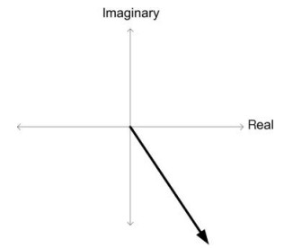
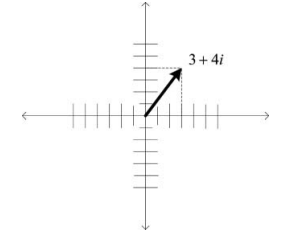
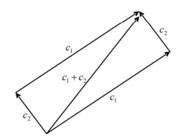
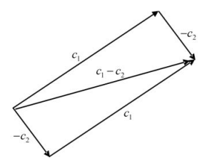

# Números Complexos para Computação Quântica

Os números complexos são essenciais para o entendimento completo da computação quântica. Sendo de extrema importância para a definição dos estados e das operações realizadas em qubits, eles operam um papel crucial em algoritmos quânticos. É fundamental entender não apenas o *conceito algébrico*, mas também suas diferentes maneiras de representação, particularmente a *interpretação geométrica*, que fornece intuição visual para operações como rotação de fase, um aspecto vital para o poder de processamento quântico.

Nesse capítulo, será apresentado as definições básicas, a estrutura algébrica - retratando também as operações em números complexos - e as noções geométricas, em que haverá a discussão de tópicos mais avançados.

A referência para esse capítulo é {cite}`Yanofsky_Quantum_2008`, que aborda o tema de números complexos com foco no entendimento da computação quântica.

## Definições Básicas

### Motivação

A motivação para ao uso de números complexos surge com um empasse na busca de soluções polinomiais, uma vez que existem equações algébricas que não podem ser solucionadas utilizando o sistema numérico usual, como por exemplos:

```{math}
x^2 + 1 = 0
```

Nesse cálculo nos deparamos com a seguinte situação:

```{math}
x = \sqrt{-1}
```

Em que, ${x^2}$ não pode ser negativo, resultando em um sistema sem solução real. E o que isso afirma? 

Que a solução da equação ${x^2 = -1}$ é um número cujo quadrado é ${-1}$, ou seja, um número ${i}$ que satisfaz ${i^2 = -1}$ ou ${i = \sqrt{-1}}$. Evidentemente, sabemos que tal número não existe no conjunto dos números reais, mas isso não nos impedirá. Admitiremos simplesmente esta nova entidade no domínio dos números já estabelecidos e a utilizaremos conforme nos for conveniente. Por ser imaginária, ela é denotada por ${i}$. Imporemos a nós mesmos uma restrição importante: exceto por seu comportamento peculiar quando elevada ao quadrado, ${i}$ se comportará exatamente como um número ordinário.

### Expressando o Número Complexo

Com a informação de que  ${i = \sqrt{-1}}$, conseguimos perceber alguns comportamentos, tais como:

```{math}
i^2 = \sqrt{-1}^2 = -1 \space \text{e} \space i^3 = \sqrt{-1}^3 = \sqrt{-1}^2 \times \sqrt{-1} = -i
```

Além de podemos elevar o ${i}$ a ${n}$ fatores, podemos multiplicar o fator ${i}$ por um número real ${b}$, e obter resultados como:

```{math}
 3i = 3\times\sqrt{-1} \space \text{e} \space 3,14i = 3,14\times\sqrt{-1}
```
Assim, podemos definir um número complexo ${c}$ sendo uma soma entre uma parte real, explicitada como um número ${a}$, e uma parte imaginária, definida por um ${i}$ que estará sendo multiplicada por outro número real ${b}$, para ilustrar:

```{math}
c = a + bi
```

Então, idenficamos qualquer número possível sendo um resultado dessa equação, como por exemplo:

```{math}
c = 3 + 7i \space \text{resulta no número complexo} \space 3 + 9i

c = 19 - 8i \space \text{resulta no número complexo} \space 19 - 8i

c = 5 + 0i \space \text{resulta no número inteiro} \space 5
```

### Soma e Subtração

Como todos os números conhecidos, nós conseguimos realizar operações matemáticas básicas entre números complexos, sendo as mais simples as operações de *soma* e *subtração*. 

Dado dois números complexos, ${c_1}$ e ${c_2}$, para realizarmos as operações de soma ou subtração deveremos operar as designadas partes do primeiro número com as partes de mesma função do segundo número complexo. Ou seja, devemos operar as partes reais dos dois números, e logo em seguida operar a parte imaginária. Resultando assim em um novo número complexo, ${c_3}$, igualmente formado por uma parte real e uma parte imaginária.

Sendo ${c_1 = 3 + 9i}$ e ${c_2 = 19 - 8i}$

A sua soma resultará em:

```{math}
c_3 = c_1 + c_2

c_3 = (3 + 9i) + (19 - 8i)

c_3 = (3 + 19) + (9i - 8i)

c_3 = 22 + i
```

E a sua subtração resultará em:

```{math}
c_3 = c_1 - c_2

c_3 = (3 + 9i) - (19 - 8i)

c_3 = (3 - 19) + (9i + 8i)

c_3 = -16 + 17i
```

### Multiplicação

A multiplicação não é tão simples quanto a soma e a subtração. Para realizar a multiplicação entre dois números complexos, ${c_1}$ e ${c_2}$, devemos realizar a distributiva entre eles para obter o resultado, ${c_3}$.

Sendo ${c_1 = 3 + 9i}$ e ${c_2 = 19 - 8i}$

A sua multiplicação resultará em:

```{math}
c_3 = c_1 \times c_2

c_3 = (3 + 9i) \times (19 - 8i)

c_3 = (3 \times 19) + (3 \times 8i) + (9i \times 19) + (9i \times 8i)

c_3 = 57 + 24i + 171i + 72i^2
```

```{admonition} Atenção
:class: tip

Nesse momento é importante lembrar da potenciação de i, ${i^2 = -1}$, que, quando aplicada na multiplicação entre ${c_1}$ e ${c_2}$ resultará em:
```

```{math}
c_3 = 57 + 24i + 171i - 72

c_3 = -15 + 195i
```

Esse resultado, permite perceber que uma das principais proposições do teorema fundamental da álgebra, que define que toda equação polinomial de uma variável com coeficientes complexos possuem uma solução complexa.

## Algebra dos Números Complexos

A Definição nos revela que cada número complexo corresponde a dois números reais: sua **parte real** e sua **parte imaginária**. Podemos, portanto, definir um número complexo como um **par ordenado de reais**:

```{math}
c \mapsto (a, b)
```

Os números reais convencionais identificam-se com pares onde a parte imaginária é zero:

```{math}
a \mapsto (a, 0)
```

Os números imaginários puros correspondem a pares onde a parte real é zero. Em particular, a unidade imaginária é:

```{math}
i \mapsto (0, 1)
```

### Adição e Subtração
A adição é definida componente a componente, ou seja, você somará a parte real com a parte real, e a parte imaginária com a parte imaginária, o mesmo vale para a subtração:

```{math}
(a_1, b_1) + (a_2, b_2) = (a_1 + a_2, b_1 + b_2)
```

### Multiplicação
A multiplicação segue uma regra menos intuitiva mas crucial, você realizará a distributiva entre os dois números complexos:

```{math}
(a_1, b_1) \times (a_2, b_2) = (a_1a_2 - b_1b_2, a_1b_2 + a_2b_1)
```

Esta definição preserva a propriedade fundamental:

```{math}
i \times i = (0, 1) \times (0, 1) = (-1, 0) = -1
```

### Forma Algébrica
Qualquer número complexo pode ser expresso na forma familiar:

```{math}
c = (a, b) = (a, 0) + (b, 0) \times (0, 1) = a + bi
```

### Propriedades Estruturais

As operações com números complexos possuem propriedades importantes:

- **Comutatividade**: ${ c_1 + c_2 = c_2 + c_1 }$ e ${ c_1 \times c_2 = c_2 \times c_1 }$
- **Associatividade**: ${ (c_1 + c_2) + c_3 = c_1 + (c_2 + c_3) }$ (idem para multiplicação)
- **Distributividade**: ${ c_1 \times (c_2 + c_3) = (c_1 \times c_2) + (c_1 \times c_3) }$

#### Elementos Identidade
Os elementos identidade são valores que, ao ser operado - soma ou multiplicação - preservam o elemento natural inalterado.
- **Aditivo**: ${ (0, 0) }$ (pois ${ c + (0, 0) = c }$)
- **Multiplicativo**: ${ (1, 0) }$ (pois ${ c \times (1, 0) = c }$)

### Divisão

A divisão é mais complexa, sendo obtida resolvendo ${ (x, y) = \frac{(a_1, b_1)}{(a_2, b_2)} }$ tal que ${ (a_1, b_1) = (x, y) \times (a_2, b_2) }$. 

Sendo assim, a solução é encontrada por:

```{math}
\frac{a_1 + b_1i}{a_2 + b_2i} = \frac{a_1a_2 + b_1b_2}{a_2^2 + b_2^2} + \frac{a_2b_1 - a_1b_2}{a_2^2 + b_2^2}i
```

```{admonition} Exemplo
:class: tip

Dado dois números complexos, ${c_1 = 3 + 2i}$ e ${c_2 = 2 + 4i}$, a divisão desses dois números resultará em:

```{math}
{\frac{3 + 2i}{2 + 4i} = \frac{(3 \times 2) + (2 \times 4)}{2^2 + 4^2} + \frac{(2 \times 2) - (3 \times 4)}{2^2 + 4^2}i = \frac{14}{20} - \frac{8}{20}i = \frac{7}{10} - \frac{2}{10}i}
```

### Módulo e Conjugação

#### Módulo
O módulo generaliza o valor absoluto dos reais, permitidindo ser encontrado por meio de:

```{math}
|c| = |a + bi| = +\sqrt{a^2 + b^2}
```

Visando isso, nota-se que, o denominador na fórmula da divisão corresponde ao quadrado do módulo do divisor.

#### Conjugação
Para conjugar um número complexo é simples, baste realizar a troca o sinal da parte imaginária:

```{math}
\overline{a + bi} = a - bi
```

##### Propriedades da Conjugação:
- Respeita adição: ${ \overline{c_1 + c_2} = \overline{c_1} + \overline{c_2} }$
- Respeita multiplicação: ${ \overline{c_1 \times c_2} = \overline{c_1} \times \overline{c_2} }$
- Relação com módulo: ${ c \times \overline{c} = |c|^2 }$

A conjugação é um **isomorfismo de corpo** - uma bijeção que preserva as operações de adição e multiplicação.

### Conclusão Algébrica

O conjunto dos números complexos **C**, com suas operações, forma um **corpo** - uma estrutura algébrica com todas as propriedades desejáveis das operações aritméticas. 

Os números reais **R** formam um **subcorpo** de **C** (identificando ${ a \in R }$ com ${ (a, 0) \in C }$). Porém, **C** possui uma propriedade crucial que **R** não tem: é **algebricamente fechado** - toda equação polinomial com coeficientes complexos possui solução em **C**.

Esta riqueza algébrica, combinada com a intuição geométrica que exploraremos a seguir, faz dos números complexos uma ferramenta poderosa em matemática e física.

## Geometria dos Números Complexos
Embora os números complexos sejam um corpo algebricamente completo como descrito anteriormente, sua importância estende-se muito além do domínio algébrico, tornando-os igualmente úteis em geometria e, consequentemente, em física. Para entender por quê, precisamos examinar os números complexos sob outra perspectiva.

### O Plano Complexo

No início da seção passada, aprendemos que um número complexo é um par de números reais. Isso sugere uma representação natural: os números reais são colocados na reta, então pares de reais correspondem a pontos no plano ou, equivalentemente, a vetores que partem da origem e apontam para esse ponto.

Nesta representação, os números reais (ou seja, números complexos sem parte imaginária) ficam no eixo horizontal e os números imaginários ficam no eixo vertical. Este plano é conhecido como **plano complexo** ou **plano de Argand**.



### Módulo como Comprimento Vetorial

Através desta representação, as propriedades algébricas dos números complexos podem ser vistas sob uma nova luz. Comecemos com o módulo: ele nada mais é do que o **comprimento do vetor**. De fato, o comprimento de um vetor, via teorema de Pitágoras, é a raiz quadrada da soma dos quadrados dos catetos *- valor no eixo real e eixo imaginário*, que é precisamente o módulo, conforme definido na seção anterior.



```{admonition} Exemplo
:class: tip

Considere o número complexo c = 3 + 4i. O comprimento do vetor é a hipotenusa do triângulo retângulo cujos lados têm comprimento 3 e 4, respectivamente. O teorema de Pitágoras nos dá:

```{math}
h = \sqrt{c_a^2 + c_o^2} = \sqrt{3^2 + 4^2} = \sqrt{9 + 16} = \sqrt{25} = 5
```


Este é exatamente o módulo de c.

### Adição e Subtração Geométricas

#### Adição
Vetores podem ser somados usando a **regra do paralelogramo**: desenhe o paralelogramo cujas arestas paralelas são os dois vetores a serem somados; sua soma é a diagonal.



#### Subtração
A subtração também tem um significado geométrico claro: subtrair c₂ de c₁ é o mesmo que somar a negação de c₂, ou seja, -c₂, a c₁. A negação de um vetor é simplesmente o vetor de mesmo comprimento apontando na direção oposta.



### Representação Polar

Para dar um significado geométrico simples à multiplicação, precisamos desenvolver outra caracterização dos números complexos. Para cada número complexo, podemos desenhar um triângulo retângulo cujos comprimentos dos catetos são as partes real e imaginária do número e cujo comprimento da hipotenusa é o módulo.

O módulo ρ e o ângulo ${\theta}$ (dois números reais, como antes) são suficientes para determinar exclusivamente o número complexo:
${
(a, b) \mapsto (\rho, \theta)
}$

#### Conversão entre Representações
- **Cartesiana para Polar**:
  ${
  \rho = \sqrt{a^2 + b^2}, \quad \theta = \arctan\left(\frac{b}{a}\right)
  }$
- **Polar para Cartesiana**:
  ${
  a = \rho \cos(\theta), \quad b = \rho \sin(\theta)
  }$

```{admonition} Exemplo
:class: tip

```{math}
\text{Seja ${c = 1 + i}$. Sua representação polar é:}

\rho = \sqrt{1^2 + 1^2} = \sqrt{2}, \quad \theta = \arctan(1) = \frac{\pi}{4}
```

c é o vetor de comprimento ${\sqrt{2}}$ a partir da origem em um ângulo de ${\frac{π}{4}}$ radianos, ou 45°.

### Magnitude e Fase

**Definição Essencial** Um número complexo é uma **magnitude** e uma **fase**.

- Os reais positivos ordinários são números complexos com fase zero
- Os reais negativos têm fase ${π}$
- Os números imaginários têm fase constante igual a ${\frac{\pi}{2}}$ (imaginário positivo) ou ${\frac{3\pi}{2}}$ (imaginário negativo)

Dada uma fase constante, há uma linha inteira de números complexos com essa fase.

### Multiplicação na Forma Polar

Dados dois números complexos em coordenadas polares, ${(ρ₁, θ₁)}$ e ${(ρ₂, θ₂)}$, seu produto pode ser obtido multiplicando suas magnitudes e somando suas fases:

```{math}
(\rho_1, \theta_1) \times (\rho_2, \theta_2) = (\rho_1\rho_2 \space , \space \theta_1 + \theta_2)
```

```{admonition} Exemplo
:class: tip

```{math}
\text{Sejam c₁ = 1 + i e c₂ = -1 + i. Seu produto, de acordo com a regra algébrica, é:}


c_1c_2 = (1 + i)(-1 + i) = -2 + 0i = -2


\text{Então, esse mesmo número em representação polar equivale a:}


c_1 = (\sqrt{2}, \frac{\pi}{4}), \quad c_2 = (\sqrt{2}, \frac{3\pi}{4})


\text{Portanto, seu produto usando a raegra geométrica é:}


c_1c_2 = (\sqrt{2} \times \sqrt{2}, \frac{\pi}{4} + \frac{3\pi}{4}) = (2, \pi)


\text{Revertendo para coordenadas cartesianas obtemos:}


(2 \times \cos(\pi), 2 \times \sin(\pi)) = (-2, 0)


\text{Que é exatamente a resposta que obtivemos utilizando do cálculo algébrico.}
```

### Multiplicação como Rotação

A multiplicação no domínio complexo está relacionada com **rotações** do plano complexo. A multiplicação por i (que tem módulo 1 e fase π/2) tem o resultado líquido de girar o número complexo original em 90°, um ângulo reto. Podemos concluir com segurança que a multiplicação por i é uma **rotação de 90° no sentido anti-horário** do plano complexo.

### Divisão na Forma Polar

Dados dois números complexos em forma polar, para obtermos o resultado de sua divisão devemos dividir as magnitudes e subtrair os ângulos:

```{math}
\frac{(\rho_1, \theta_1)}{(\rho_2, \theta_2)} = \left(\frac{\rho_1}{\rho_2}, \theta_1 - \theta_2\right)
```

```{admonition} Exemplo
:class: tip

```{math}
\text{Sejam  ${ c_1 = 1 + i }$ e ${ c_2 = -1 + i }$. Primeiro, vamos calcular a divisão ${ \frac{c_1}{c_2} }$ usando a regra algébrica:}

\frac{c_1}{c_2} = \frac{1 + i}{-1 + i}


\text{Multiplicando numerador e denominador pelo conjugado do denominador:}


\frac{1 + i}{-1 + i} \cdot \frac{-1 - i}{-1 - i} = \frac{(1 + i)(-1 - i)}{(-1 + i)(-1 - i)}

\text{Portanto:}


\frac{c_1}{c_2} = \frac{-2i}{2} = -i


\text{Então, esse mesmo número em representação polar equivale a:}


c_1 = (\sqrt{2}, \frac{\pi}{4}), \quad c_2 = (\sqrt{2}, \frac{3\pi}{4})


\text{Portanto, sua divisão usando a regra geométrica é:}


\frac{c_1}{c_2} = \left( \frac{\sqrt{2}}{\sqrt{2}}, \frac{\pi}{4} - \frac{3\pi}{4} \right) = (1, -\frac{\pi}{2})


\text{Revertendo para coordenadas cartesianas obtemos:}


(1 \times \cos(-\frac{\pi}{2}), 1 \times \sin(-\frac{\pi}{2})) = (0, -1)

\text{Que é exatamente a resposta que obtivemos utilizando do cálculo algébrico ${-i = 0 - 1i}$}.
```

### Potências e Raízes

#### Potências
Se ${c = (ρ, θ)}$ é um número complexo na forma polar e n um inteiro positivo, sua n-ésima potência é dada pela múltiplicação de si mesmo ${n}$ vezes, que quando simplificada resulta na fórmula:

```{math}
c^n = (\rho^n, n\theta)
```

#### Raízes
A n-ésima raiz de um número complexo é mais complicada de se definir, sendo entendida como:

```{math}
c^{\frac{1}{n}} = \left(\sqrt[n]{\rho}, \frac{1}{n}(\theta + k2\pi)\right)
```

Existem **precisamente n raízes n-ésimas** para um número complexo.

### Fórmula de Euler e Forma Exponencial

A **fórmula de Euler** nos permite escrever números complexos de uma outra maneira, estabelecendo uma noção essencial para o entendimento da computação quântica:

```{math}
e^{i\theta} = \cos(\theta) + i \sin(\theta)
```

Isso nos permite reescrever qualquer número complexo na **forma exponencial**:

```{math}
c = \rho e^{i\theta}
```

#### Propriedades
Assim, percebemos determinadas propriedades, como:
- Multiplicação: ${ c_1c_2 = \rho_1 e^{i\theta_1} \rho_2 e^{i\theta_2} = \rho_1\rho_2 e^{i(\theta_1 + \theta_2)} }$
- A função exponencial leva somas em produtos: ${ e^{i(\theta_1 + \theta_2)} = e^{i\theta_1} \times e^{i\theta_2} }$

### Raízes da Unidade

As raízes n-ésimas da unidade ${(1 = (1, 0) = 1 + 0i)}$ são dadas por:

```{math}
c^{\frac{1}{n}} = (1, 0)^{\frac{1}{n}} = \left(\sqrt[n]{1}, \frac{1}{n}(0 + 2k\pi)\right) = \left(1, \frac{2k\pi}{n}\right)
```

Permitindo ${k = 0, 1, 2, ..., n - 1}$, obtemos n raízes diferentes da unidade. A k-ésima raiz da unidade na forma exponencial é ${ e^{2\pi ik/n} }$. Denotamos essas n raízes diferentes da unidade por:
${
\omega^0_n = 1, \omega^1_n, \omega^2_n, \ldots, \omega^{n-1}_n
}$

Geometricamente, essas n raízes da unidade correspondem a dividir o círculo unitário em n partes onde a primeira partição é ${(1, 0)}$.

### Transformações de Möbius

Além dos polinômios, o próximo conjunto de funções são as **funções racionais**, ou quocientes de polinômios. O caso mais simples e importante é:

```{math}
R_{a,b,c,d}(x) = \frac{ax + b}{cx + d}
```

onde ${a, b, c, d \in \mathbb{C} \space \text{e} \space  ad - bc \neq 0}$. Esta é conhecida como **transformação de Möbius**.

#### Propriedades das Transformações de Möbius
- A composição de duas transformações de Möbius é uma transformação de Möbius
- A transformação identidade é uma transformação de Möbius
- Cada transformação de Möbius tem uma inversa que também é uma transformação de Möbius

### Conclusão

Cobrimos a linguagem básica dos números complexos e suas interpretações geométricas. Esta compreensão será fundamental para o entendimento da computação quântica, onde precisaremos de outra ferramenta: **${\text{ALGEBRA} \space \text{LINEAR}}$**.
