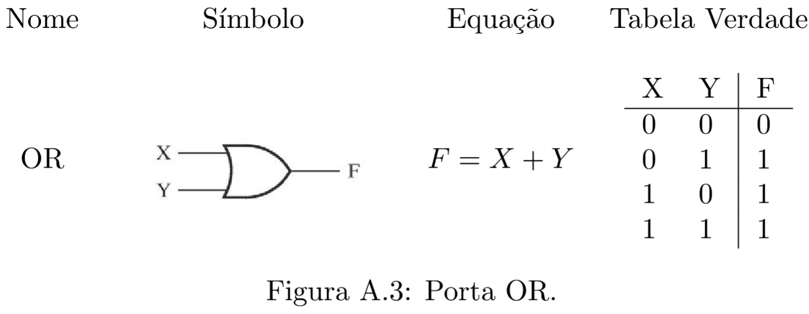
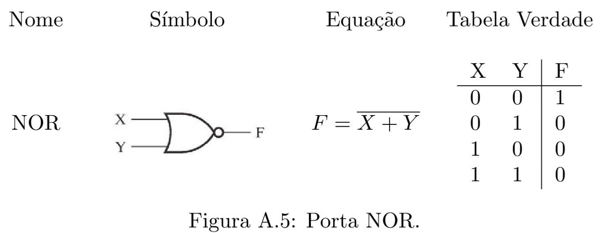

# Computação Clássica

:::{admonition} Referências
Material extraído do TCC [*Computação Quântica: Uma abordagem para estudantes de graduação em Ciências Exatas*](./tcc-giovani.pdf), de Giovani Goraiebe Pollachini.
:::

 Um computador digital é um sistema que pode seguir uma sequência de instruções, chamada programa, e que opera em um conjunto de informações. Os computadores digitais modernos são compostos de milhões a bilhões de transistores, que se agrupam em circuitos digitais. Para lidar com a complexidade desses sistemas, os circuitos são subdivididos em circuitos menores, que realizam funções específicas. Esses circuitos são considerados ``caixas pretas'', em que se ignoram os detalhes internos, e são agrupados de forma a realizar funções mais sofisticadas. 

A engenharia trabalha com *níveis de abstração*; cada nível corresponde a omitir detalhes internos dos subsistemas constituíntes, ou da camada de abstração anterior. Uma discussão mais detalhada sobre as camadas de abstração do computador será realizada na seção seguinte. 

Para que o computador consiga operar em um conjunto de informações, é necessário que essa informação seja traduzida, ou, codificada, de forma conveniente. O projeto dos computadores digitais se baseia em que as informações de entrada do sistema, e mesmo as instruções a serem seguidas, são codificadas em *bits*. 

Os bits são variáveis que podem assumir apenas dois valores, rotulados de 0/1 ou Verdadeiro/Falso, por exemplo. No computador digital, a tensão elétrica é utilizada como bit; as tensões próximas a $0V$ são consideradas como bit 0 e as tensões próximas à tensão de alimentação do circuito (normalmente $5V$ ou $3,\!3V$), como bit 1. 

Nas seções seguintes alguns desses tópicos serão detalhados. A ênfase será nas ideias vinculadas aos Sistemas Digitais, no manejo da complexidade por meio das camadas de abstração e nos detalhes das camadas mais próximas da camada física, com o objetivo de passar a ideia de como um computador digital clássico funciona. A finalidade é, também, comparar esse paradigma de computação com as ideias que estão surgindo na área da Computação Quântica.

## Niveis de abstração

Na engenharia, uma maneira de lidar com a complexidade de sistemas muito grandes é subdividí-los em subsistemas que possam ser descritos de maneira mais simples, omitindo detalhes internos. Componentes mais básicos são usados para projetar blocos que realizam funções simples. Esses blocos passam a ser descritos apenas pela sua função (como as saídas se comportam em relação às entradas), e passa-se a ignorar sua estrutura interna. Sistemas mais complexos podem ser projetados por meio desses blocos. A cada vez que se agrupa os sistemas em blocos e passa-se a ignorar sua estrutura interna, sobe-se um nível nas *camadas de abstração*. Quando se ``abre'' um sistema para analisar sua estrutura interna, passa-se à camada de abstração inferior. 

Essa divisão em camadas de abstração permite que os diversos blocos do sistema sejam projetados de forma paralela. Além disso, o projeto de um bloco pode ser reaproveitado em outros momentos, no mesmo projeto ou em outros. Outra vantagem é que o sistema passa a ser visto como composto de uma quantidade relativamente pequena de subsistemas, em vez de ser visto como milhões de transistores, cujo funcionamento em conjunto seria virtualmente impossível de descrever diretamente. 

A figura a seguir ilustra as camadas de abstração presentes no computador digital. Dependendo do autor, as camadas de abstração são nomeadas de maneira ligeiramente diferente ou são consideradas algumas subcamadas extra.

$$
\begin{array}{c}
\text{Camadas de Abstração} \\ \hline
\text{Linguagens de Programação} \\
\text{Instruction Set Architecture} \\
\text{Microarquitetura} \\
\text{Transferência de Registrador} \\
\text{Portas Lógicas} \\
\text{Circuitos Transistorizados} \\
\text{Nível Físico}
\end{array}
$$

## Nível lógico

O nível lógico refere-se à camada de abstração imediatamente acima da dos transistores. Os transistores são reunidos em *portas lógicas*. Nessa camada de abstração, os sinais de tensão na entrada e na saída são interpretados como bits, e as portas lógicas que operam esses bits simulam as funções lógicas como OR, AND, NOT, entre outras.

Nesse agrupamento em blocos os detalhes internos do circuito são ignorados. 

### Álgebra booleana

As *variáveis booleanas* são variáveis que podem assumir apenas dois valores, rotulados como 0/1 ou Falso/Verdadeiro. Os bits são sinônimos de variáveis booleanas. As funções $f\colon \{0,1\}^n \to \{0,1\}^m \,$, que levam um conjunto de $n$ bits em um conjunto de $m$ bits, são chamadas *funções booleanas*. As funções booleanas podem ser especificadas por expressões matemáticas ou por uma tabela  -- a \emph{tabela verdade} -- listando todos os possíveis valores de entrada e a saída atribuída a cada valor de entrada. 
 
 Algumas funções booleanas elementares são chamadas de portas lógicas. As três operações básicas da Álgebra Booleana são $+ \colon \{0,1\}^2 \to \{0,1\}$, $\cdot\, \colon \{0,1\}^2 \to \{0,1\}$ e $\overline{\phantom{a}} \colon \{0,1\} \to \{0,1\}$, também chamadas de operações OR, AND e NOT, respectivamente. 
 
 A Álgebra Booleana pode ser interpretada como descrição de um sistema lógico em que há apenas dois valores lógicos -- Falso/Verdadeiro ou 0/1 -- e às proposições lógicas pode ser atribuído um e apenas um desses valores devido ao princípio lógico elementar do terceiro excluído.
 
 Neste trabalho, o enfoque será mais voltado às aplicações em Sistemas Digitais.
 
## Portas lógicas

As portas lógicas são funções booleanas simples, blocos fundamentais dos circuitos digitais. As portas lógicas mais importantes são descritas resumidamente nas figuras a seguir. 

Qualquer sistema físico que se comporte de maneira a fornecer uma tabela verdade como as apresentadas acima pode ser considerado uma porta lógica. 

## Teoremas da Álgebra Booleana

Apresentam-se algumas identidades booleanas úteis para simplificação de expressões. 

### Teoremas da Álgebra Booleana para uma variável

Valem as seguintes identidades:

$$
\begin{split}
  X \cdot 0  &= 0 \\
  X \cdot 1  &= X \\
  X \cdot X  &= X \\
  X \cdot \overline{X} &= 0
 \end{split}
$$

$$
\begin{split}
 X + 0 &= X \\
 X + 1 &= 1 \\
 X + X &= X  \\
 X + \overline{X} &= 1 
\end{split}
$$

**Prova:**

As igualdades se verificam testando todos os casos:

$$
\begin{array}{lll}
   X \cdot 0 \, = 0 \, \, \, \,:  \begin{cases}
                         0\cdot 0 = 0 & (X=0) \\ 1\cdot 0 = 0  & (X=1)
                       \end{cases}
   & &
     X + 0 \, = 0 \, \, \, \, :  \begin{cases}
                       0 + 0 = 0 & (X=0)\\  1 + 0 = 1 & (X=1)
                       \end{cases} 
 \\ 
  X \cdot 1 \, = X \, \, :  \begin{cases}
                         0\cdot 1 = 0 & (X=0) \\ 1\cdot 1 = 1  & (X=1)
                       \end{cases}
   & &
     X + 1 \, = 1 \, \, \, \, :  \begin{cases}
                       0 + 1 = 1 & (X=0)\\  1 + 1 = 1 & (X=1)
                       \end{cases} 
 \\ 
  X \cdot X \, = X:  \begin{cases}
                         0\cdot 0 = 0 & (X=0) \\ 1\cdot 1 = 1  & (X=1)
                       \end{cases}
   & &
     X + X \, = X :  \begin{cases}
                       0 + 0 = 0 & (X=0)\\  1 + 1 = 1 & (X=1)
                       \end{cases} 
  \\ 
  X \cdot \overline{X} \, = 0 \, \, :  \begin{cases}
                         0\cdot 1 = 0 & (X=0) \\ 1\cdot 0 = 0  & (X=1)
                       \end{cases}
   & &
     X + \overline{X} \, = 1 \, \, :  \begin{cases}
                       0 + 1 = 1 & (X=0)\\  1 + 0 = 1 & (X=1)
                       \end{cases} 
  \end{array}
$$

### Teoremas da Álgebra Booleana para várias variáveis

Valem as seguintes identidades:

$$
\begin{array}{ll}
   Associatividade & 
    \begin{array}{l}
    X + (Y + Z) = (X + Y) + Z \\
    (XY)Z = X(YZ) 
   \end{array} 
    \\\\
   Comutatividade &
   \begin{array}{l}
    X + Y = Y + X \\
    X Y = YX 
   \end{array} 
     \\\\
   Distributividade &
   \begin{array}{l}
    X (Y+Z) = XY + XZ \\
    (X+Y)Z = XZ + YZ \\
    (X+Y)(Z+W) = XZ + XW + YZ + YW 
   \end{array} 
     \\\\
   Outras &
   \begin{array}{l}
    X + XY = X\\
    X + \overline{X}Y = X+Y \\
    \overline{X} + XY = \overline{X} + Y
   \end{array} 
   \end{array}
$$

**Prova:**

A verificação se dá atribuindo valores às variáveis ou escrevendo a tabela verdade dos dois lados da equação e verificando que o resultado é o mesmo. Pode-se usar o teorema 1 para facilitar. Por exemplo, verifica-se a identidade do $X (Y+Z) = XY + XZ $: 

 Para $X=0$:  $0(Y+Z) = 0 = 0Y + 0Z$. 
 
 Para $X=1$:  $1(Y+Z) = Y+Z = 1Y + 1Z$.

### Teoremas DeMorgan

Valem as seguintes identidades booleanas:

$$ 
\begin{split}
     \overline{X + Y} &= \overline{X} \cdot \overline{Y} \\
     \overline{X \cdot Y} &= \overline{X} + \overline{Y}
    \end{split}
$$

#### Prova

Mostrando $  \overline{X + Y} = \overline{X} \cdot \overline{Y}$:

$$
 \begin{array}{cc|cc|ccc}
    X & Y & X+Y & \overline{X + Y} & \overline{X} & \overline{Y} & \overline{X} \cdot \overline{Y} \\ \hline
    0 & 0 & 0   & 1 & 1 & 1 & 1 \\
    0 & 1 & 1   & 0 & 1 & 0 & 0 \\
    1 & 0 & 1   & 0 & 0 & 1 & 0 \\
    1 & 1 & 1   & 0 & 0 & 0 & 0 
  \end{array}
$$

  Os valores das colunas $\overline{X + Y}$ e $\overline{X} \cdot \overline{Y}$ coincidem, portanto vale a igualdade.  \\
    Mostrando $  \overline{X \cdot Y} = \overline{X} + \overline{Y}$:

$$    
 \begin{array}{cc|cc|ccc}
    X & Y & X\cdot Y & \overline{X \cdot Y} & \overline{X} & \overline{Y} & \overline{X} + \overline{Y} \\ \hline
    0 & 0 & 0   & 1 & 1 & 1 & 1 \\
    0 & 1 & 0   & 1 & 1 & 0 & 1 \\
    1 & 0 & 0   & 1 & 0 & 1 & 1 \\
    1 & 1 & 1   & 0 & 0 & 0 & 0 
  \end{array}
$$

  Como os valores das colunas $\overline{X \cdot Y}$ e $\overline{X} + \overline{Y}$ coincidem, igualdade é válida.

## Universalidade das Portas Lógicas Clássicas

Com apenas algumas das portas lógicas apresentadas nesse artigo pode-se compor qualquer função booleana. 

-**Teorema 1 (Universalidade das Portas Lógicas Clássicas)**: Uma função booleana $f \colon \{0,1\}^m \to \{0,1\}^n$ qualquer pode ser implementada por uma composição das portas lógicas OR, AND e NOT (além das portas SWAP e FANOUT).

**Teorema 2 (Universalidade da porta NAND)**:  Uma função booleana $f \colon \{0,1\}^m \to \{0,1\}^n$ qualquer pode ser implementada por uma composição de portas lógicas NAND (além das portas SWAP e FANOUT).

