# Computação Quântica

A *Computação Quântica* é um novo paradigma de computação em que utilizam-se sistemas quânticos -- os *qubits*, análogos dos bits clássicos -- para se realizar processamento de informação. Lançam-se mão de alguns recursos não existentes na Computação Clássica, como *superposição* e *emaranhamento*. 
 
 Há uma variedade de modelos de Computação Quântica, dentre os quais pode-se citar:

  - **Computação Quântica de Circuitos** -- computação realizada com portas lógicas quânticas, análogas às portas lógicas dos sistemas digitais clássicos;
   
  - **Computação Quântica Adiabática** -- o sistema é preparado no estado fundamental e sofre a ação de um hamiltoniano que depende continuamente do tempo e que é projetado de forma que o estado fundamental, após a aplicação do hamiltoniano, contenha a solução do problema codificada
  - **Máquina de Turing Quântica** -- uma versão quântica da Máquina de Turing Clássica;
  - **Caminhada Aleatória Quântica** -- versão quântica da caminhada aleatória clássica; é possível realizar computação quântica universal com esse modelo de computação.
 
  O presente trabalho aborda apenas a Computação Quântica de Circuitos.

 ## Computação quântica de circuitos

 Este modelo de Computação Quântica guarda analogia com a Computação Clássica com Portas Lógicas, apresentada no início do artigo. A informação é codificada em qubits, e o processamento é feito por evolução temporal do sistema segundo operações unitárias. 

 

  Esquema geral de um computador quântico no modelo de circuitos. Os qubits são preparados em estados iniciais e são submetidos a operações unitárias simbolizadas pela caixa de rótulo $U$. Após a sequência de operações, os qubits são lidos (ocorre a medição dos qubits na base computacional), fornecendo uma sequência de bits clássicos com o resultado da computação

**Número de entradas e saídas**
 
 Os circuitos quânticos devem ter o mesmo número de entradas e saídas, pois qubits não são introduzidos ou removidos durante o processamento e as portas lógicas quânticas são operadores, o que significa que preservam o número de qubits em que atuam. Diferentemente do que ocorre com os circuitos clássicos, nos quais há portas com diferentes números de bits à entrada e à saída (como as portas AND e NOT, por exemplo). 
 
**Reversibilidade da Computação Quântica**
 
 Outra diferença é os circuitos quânticos são essencialmente \emph{reversíveis}, ou seja, existe um circuito quântico inverso que consegue retornar as entradas originais do circuito a partir das saídas do mesmo. Isso ocorre porque o processamento se dá por operadores unitários, que são reversíveis, com inversos também dados por operadores unitários. Apesar de a maior parte da Computação Quântica ser reversível, há uma etapa irreversível: a medição dos qubits.
 
 Nos circuitos clássicos, a maioria das portas lógicas não são reversíveis. A porta AND, por exemplo, fornece resultado 1 se ambas as entradas forem 1 e fornece 0 caso contrário; no caso de a saída ser 0, não sabemos qual/quais das entradas é 0. 
 
 Não há um impedimento absoluto para a Computação Clássica ser reversível. De fato, há investigações relacionadas a circuitos clássicos reversíveis, constituídos apenas por portas lógicas reversíveis. 
 
 Há uma expectativa de que a computação reversível seja mais eficiente em termos energéticos que a computação irreversível. Isso se deve ao \emph{princípio de Landauer}, que diz que o apagamento de 1 bit de informação está associado a uma dissipação de energia para o ambiente de, no mínimo, $kT \ln 2$ .Em tese, se forem evitados os apagamentos de informação, a computação poderia ser feita sem gasto energético apreciável. 
 
 ## O qubit

 ### Descrição Matemática do Qubit
  O qubit é um sistema físico que pode ser descrito por um espaço de Hilbert de dimensão 2. Os estados da base canônica são rotulados por $\ket{0}$ e $\ket{1}$, e um estado geral para o qubit é o vetor unitário
  
$$
\ket{\psi} = a \ket{0} + b\ket{1}
$$

em que $|a|^2 + |b|^2 = 1$ e $a,b \in \mathbb{C}$. 

### Fase Relativa e Fase Global

#### Fase Global

Chama-se *fase global* uma fase complexa multiplicando o estado de um qubit: $e^{i\alpha}\ket{\psi}$. Dois estados $\ket{\psi_1}$ e $\ket{\psi_2} = e^{i\alpha}\ket{\psi_1}$, iguais a menos de uma fase global, não podem ser distinguidos fisicamente. De fato, dado um observável $A = \sum_k a_k P_k$, a probabilidade de o resultado de uma medida ser $a_k$, nos dois casos, é igual:

$$
 p_2(a_k) =  ||P_k e^{i\alpha}\ket{\psi_1}||^2 = |e^{i\alpha}|^2 ||\ket{\psi_1}||^2 =  p_1(a_k) \ . 
$$
 
A evolução temporal nos dois estados também é idêntica, a menos do fator $e^{i\alpha}$, devido à linearidade dos operadores de evolução:

$$
 U\ket{\psi_2} = Ue^{i\alpha}\ket{\psi_1} = e^{i\alpha}U\ket{\psi_1}
$$
 
e uma subsequente medição não conseguiria distinguir esses dois estados que diferem apenas por uma fase global.
Na formação de um sistema composto, os vetores $\ket{\psi_1}$ e $\ket{\psi_2} = e^{i\alpha}\ket{\psi}$ produzem resultados idênticos, a menos da fase global $\alpha$, dada a multilinearidade do produto tensorial:

$$
 \ket{\psi_2} \otimes \ket{\phi} = \big(e^{i\alpha}\ket{\psi_1}\big) \otimes \ket{\phi} = e^{i\alpha} \big( \ket{\psi_1} \otimes \ket{\phi}
$$

Do mesmo modo, uma medida posterior não conseguiria distinguir esses dois estados. 

Dessa forma, a fase global não tem relevância física, e um sistema descrito por um vetor de estado $\ket{\psi}$ também pode ser descrito pelo vetor $e^{i\alpha}\ket{\psi}$. 

#### Fase Relativa

A *fase relativa* em um qubit é a diferença de fase entre os coeficientes que multiplicam o $\ket{1}$. Por exemplo, os vetores 

$$
 \ket{+} =  \frac{\ket{0} +i \ket{1}}{\sqrt{2}} \ \ \text{e} \ \  \ket{-} =  \frac{\ket{0} - \ket{1}}{\sqrt{2}}
$$

têm mesmo coeficiente multiplicando $\ket{0}$ e diferem apenas por um fator $-1 = e^{i \pi}$ multiplicando $\ket{1}$, isto é, por uma fase relativa de $\pi$. 
 
De forma geral, os estados 

$$
 \ket{\psi_1} = a\ket{0} + b\ket{1} \ \ \text{e} \ \  \ket{\psi_2} = a\ket{0} + b e^{i\varphi}\ket{1}
$$
 
diferem por fase relativa $\varphi$. Esses estados apresentam mesmas probabilidades em uma medida na base computacional:

$$
\begin{split}
   p_2(\ket{0}) = |a|^2 = p_1(\ket{0})
  \end{split}
$$

$$
p_2(\ket{1}) = |b e^{i\varphi}|^2 = |b|^2  |e^{i\varphi}|^2 =  |b|^2 =  p_1(\ket{1})
$$

 no entanto, em bases diferentes, podem apresentar probabilidades diferentes. Exemplificando, os estados $\ket{+}$ e $\ket{-}$ diferem por uma fase relativa, no entanto formam uma base. E a medida nessa base fornece resultados distintos. A evolução por transformações unitárias também apresenta resultados diferentes. Por exemplo, a aplicação do operador unitário $H$ fornece $H\ket{+} = \ket{0}$ e $H\ket{-} = \ket{1}$.
 
Assim, ao contrário da fase global, a fase relativa apresenta relevância física.

#### Representação de um Qubit na Esfera de Bloch

O estado $\ket{\psi} = a \ket{0} + b\ket{1}$ de um qubit pode ser reescrito, a menos de uma fase global, como 

$$
 \ket{\psi} = \cos(\theta/2)\ket{0} + e^{i\varphi} \sin(\theta/2) \ket{1} \ , \ \ \theta \in [0,\pi] , \varphi \in [0,2\pi)
$$
 
Pode-se multiplicar o estado por uma fase global para que o termo multiplicando $\ket{0}$ seja real e positivo. Fazendo-se essa identificação em relação à fase global, tem-se o estado de um qubit descrito por dois parâmetros $\theta$ e $\varphi$. Utilizando esses dois parâmetros no sistema de coordenadas esféricas, pode-se corresponder os estados de um qubit com os pontos na superfície de uma esfera de raio unitário, a chamada *Esfera de Bloch*. 

#### Pontos na Esfera de Bloch

Os polos norte da esfera corresponde ao estado $\ket{0}$ e o polo sul, ao $\ket{1}$. No equador, situam-se os estados da forma $\frac{1}{\sqrt{2}} \ket{0} + \frac{e^{i\varphi}}{\sqrt{2}} \ket{1}$, isto é, superposições dos estados $\ket{0}$ e $\ket{1}$ com o mesmo peso e com alguma fase relativa.

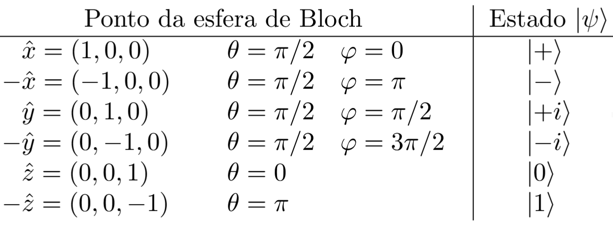

Observe que os vetores da base $\mathcal{X}$ correspondem às intersecções da esfera com o eixo $x$. De forma similar, isso vale para as bases $\mathcal{Y}$ e $\mathcal{Z}$, que correspondem às intersecções da esfera com os eixos $y$ e $z$, respectivamente.

#### Projeções nos eixos coordenados

As projeções nos eixos $x$, $y$ e $x$ de um ponto $\vec{r}$ na superfície da esfera de Bloch são dadas pelas coordenadas esféricas:

$$
 \begin{split}
    \vec{r} 
    &= r_x \, \vec{x} + r_y \, \vec{y} + r_z \, \vec{z}  \\
    &= \sin \theta \cos \varphi \, \vec{x} + \sin \theta \sin \varphi \, \vec{y} + \cos \theta \, \vec{z} \ , \ \ \theta \in [0,\pi] , \varphi \in [0,2\pi) \ .
   \end{split}
 $$  
 
Essas projeções correspondem aos valores esperados dos operadores hermitianos $X$, $Y$ e $Z$ de Pauli:

$$
\begin{split}
    r_x &= \sin \theta \cos \varphi = X \\
    r_y &= \sin \theta \sin \varphi = Y \\
    r_z &= \ \ \   \cos \theta \ \ \ \, = Z \ . 
   \end{split}
$$

## Notação de Circuitos

 Os detalhes da notação utilizada para representar circuitos quânticos serão vistos nesta seção. 

 
**Entradas e saídas**

 O circuito deve conter o mesmo número de entradas e saídas (às vezes podem estar omitidas quando não utilizadas). Cada qubit é representado por uma linha horizontal, e linhas duplas representam bits clássicos. Pode-se pôr rótulos nos qubits para indicar em que estado se encontram na entrada.

 Os qubits de entrada podem se encontrar em estados $\ket{0}$, $\ket{1}$ ou em superposições desses estados. Também podem encontrar-se em estados emaranhados, não possíveis de se exprimir como produto tensorial de estados de 1 qubit. 

## Sequência de operações

A passagem do tempo, e portanto a sequência de operações, é representada da esquerda para a direita. Ocasionalmente pode-se representar o circuito na forma vertical, e a passagem do tempo é representada de cima para baixo.

## Símbolos para Portas Lógicas Quânticas

As portas lógicas quânticas são representadas por caixas contendo o mesmo número de entradas e saídas. As portas lógicas controladas são portas lógicas de mais de 1 qubit em que pelo menos um dos qubits age como controle; o qubit de controle é representado por um círculo (mais detalhes serão vistos posteriormente). 

 

 Exemplos de portas lógicas quânticas. (1) Porta lógica de 1 qubit. (2) Porta lógica controlada de 2 qubits. (3) Porta lógica de 3 qubits.

 ## Medições de qubits

 As medições são as únicas operações potencialmente irreversíveis de um circuito quântico. Em geral são realizadas na base computacional $\ket{0}$ e $\ket{1}$. A notação para medições é ilustrada abaixo, em que, novamente, fica implícito que a base de medidas é a computacional. Após a medição na base computacional, o resultado é um bit clássico.

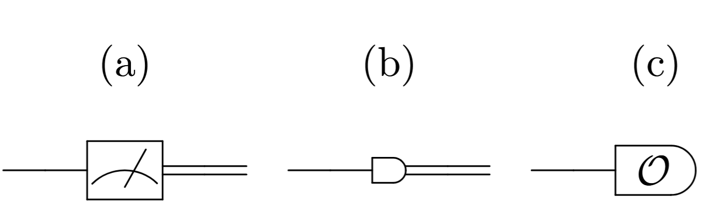

Notações possíveis para medição de qubits. Após a medição na base canônica, o resultado é um cbit. (1) e (2) Medição na base canônica. (3) Medição de um observável $\mathcal{O}$ especificado.

## Portas Lógicas Quânticas

As portas lógicas quânticas são operações unitárias aplicadas em um ou mais qubits. Nesta seção, essas portas lógicas são apresentadas em detalhes. 

### Portas Lógicas de 1 Qubit

Estas portas lógicas atuam em 1 qubit apenas. São descritas por matrizes unitárias $2 \times 2$. As portas lógicas apresentadas nesse tópico são as portas $X$, $Y$ e $Z$ de Pauli (também denotadas por $\sigma_x$, $\sigma_y$ e $\sigma_z$, respectivamente), a porta $H$ de Hadamard, a porta de fase ou porta $S$ e a porta $\tfrac{\pi}{8}$ ou porta $T$.

**Porta X de Pauli ou NOT quântico**

A porta $X$ de Pauli é a operação unitária de 1 qubit que, na base computacional, é representada pela matriz de Pauli $X = \sigma_x$. Algumas informações dessa porta estão resumidas na figura abaixo.

**Porta Y de Pauli**

 A porta $Y$ de Pauli é a operação unitária de 1 qubit que, na base computacional, é representada pela matriz de Pauli $Y = \sigma_y$. Algumas informações dessa porta estão dispostas abaixo.

**Porta Z de Pauli**

A porta $Z$ de Pauli é a operação unitária de 1 qubit que é representada na base computacional pela matriz de Pauli $Z = \sigma_z$. Essa porta introduz uma fase relativa de $\pi$, o que corresponde a multiplicar o $\ket{1}$ por $-1 = e^{i\pi}$, como se pode observar no quadro a seguir.

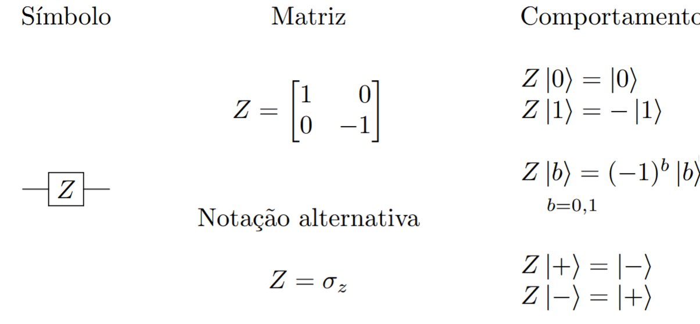

**Porta Hadamard**

A porta de Hadamard é uma operação unitária de 1 qubit representada na base computacional pela matriz de Hadamard $H$. Essa matriz, definida abaixo, também realiza mudança de base de $\mathcal{I} = \big\lbrace \ket{0}, \ket{1}\big\rbrace$ para $\mathcal{X} = \big\lbrace \ket{+}, \ket{-}\big\rbrace$ e vice-versa

**Porta de Fase ou Porta S**

A porta $S$ introduz uma fase relativa de $\frac{\pi}{2}$ no qubit em que atua, levando um estado $a \ket{0} + b \ket{1}$ em um estado $a \ket{0} + i b \ket{1}$, já que $i = e^{i\frac{\pi}{2}}$. Os detalhes pertinentes a essa porta lógica estão dispostos abaixo. 

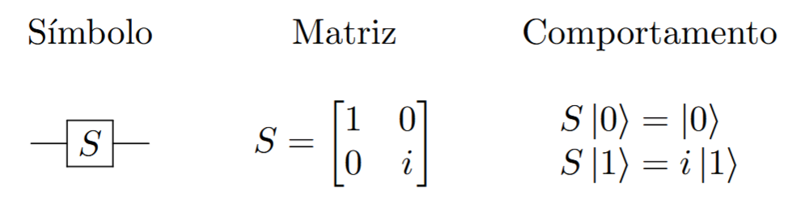

**Porta T ou Porta $\frac{\pi}{8}$**

 A porta $T$, também conhecida como porta $\frac{\pi}{8}$, é uma porta lógica que introduz uma fase relativa de $\frac{\pi}{4}$, levando um estado $a\ket{0} + b \ket{1}$ em $a\ket{0} + e^{i\frac{\pi}{4}} b \ket{1}$. 
   
O nome $\frac{\pi}{8}$ dessa porta se deve ao fato de poder ser escrita na forma
 
$$
T = e^{i\frac{\pi}{8}} \begin{bmatrix} 
e^{-i\frac{\pi}{8}} & 0 \\ 
0 & e^{i\frac{\pi}{8}} 
\end{bmatrix}
$$

   Isso significa que, a menos de uma fase global, essa operação realiza uma mudança de fase de $+\frac{\pi}{8}$ no estado $\ket{0}$ e de $-\frac{\pi}{8}$ no estado $\ket{1}$.  
 

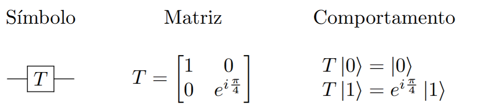

**Porta de Fase $\theta$**

A porta de fase pode ser generalizada para uma fase arbitrária $\theta$.  Nesse caso, a aplicação dessa porta, denotada por $S(\theta)$ leva um estado $a\ket{0} + b\ket{1}$ em $a\ket{0} + e^{i\theta} b\ket{1}$. A matriz que realiza isso é mostrada a seguir. 

Como casos particulares, tem-se

$$
Z = S(\pi) \ , \ \ S = S(\tfrac{\pi}{2}) \ \text{e} \ \ T = S(\tfrac{\pi}{4})
$$

#### Portas Lógicas de 2 Qubits

As portas lógicas de 2 qubits são realizadas por matrizes unitárias $4\times 4$. As principais operações são CNOT (NOT controlada), $Z$ controlada e SWAP, descritas abaixo. 

**Porta CNOT**

A porta CNOT, ou NOT controlada, é uma porta de 2 qubits em que um deles exerce a função de controle e o outro, a de alvo. Em geral, quando não especificado, o primeiro qubit é o controle e o segundo, o alvo. Se o qubit de controle for $\ket{0}$, nada acontece com o qubit alvo. Se o controle for $\ket{1}$, a porta NOT quântica (porta $X$ de Pauli) é aplicada ao alvo:

$$
\text{CNOT} \ket{0}_1\ket{1}_2 = \ket{0}_1\ket{1}_2 \ , \ \ \text{CNOT}\ket{1}_1\ket{0}_2 = X_2 \ket{1}_1 \ket{0}_2 = \ket{1}_1 \ket{1}_2
$$
  
  Esse comportamento é análogo à entrada ``enable'' em circuitos digitais clássicos, que permite a ação do circuito se está habilitada em 1, ou nada acontece, se o enable é 0. A novidade na Computação Quântica é que a entrada de controle é um qubit e pode, portanto, se encontrar em uma superposição de estados, como $\frac{\ket{0}+\ket{1}}{\sqrt{2}}$. A aplicação da porta CNOT, em casos como esse, ficaria
  
$$
\begin{split}
  \text{CNOT}\frac{\ket{0}_1+\ket{1}_1}{\sqrt{2}}\ket{1}_2 
      &= \frac{1}{\sqrt{2}} \big( \text{CNOT}\ket{0}_1 \ket{1}_2 + \text{CNOT}\ket{1}_1 \ket{1}_2 \big) \\
      &= \frac{1}{\sqrt{2}} \big( \ket{0}_1 \ket{1}_2 + \ket{1}_1 \ket{0}_2 \big) \ .
\end{split}
$$
  
  A porta CNOT tem suas informações resumidas no quadro abaixo.

A porta CNOT também pode aparecer com o controle no segundo qubit e alvo no primeiro qubit. Nesse caso, podem ser usados índices no símbolo CNOT para especificar o controle e o alvo em situações mais específicas. Por exemplo:

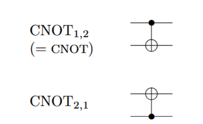

Uma notação semelhante pode ser usada em outras portas controladas para especificar o qubit de controle e o de alvo. 

**Porta Z Controlada**

A porta $Z$ controlada também atua em 2 qubits, um deles com função de controle e o outro, de alvo. Se o controle (o primeiro qubit) for $\ket{0}$, o alvo (segundo qubit) não se modifica, e se o controle for $\ket{1}$, aplica-se uma porta $Z$ de Pauli ao alvo, como se pode ver no quadro a seguir. Se os qubits estiverem em superposição, basta usar a linearidade do operador CZ e atuar em cada estado da base computacional isoladamente: 

$$
\begin{split}
     \text{CZ} \frac{\ket{0}_1+\ket{1}_1}{\sqrt{2}}\ket{1}_2 
     &= \frac{1}{\sqrt{2}} \big( \text{CZ}\ket{0}_1 \ket{1}_2 + \text{CZ}\ket{1}_1 \ket{1}_2 \big) \\
     &= \frac{1}{\sqrt{2}} \big( \ket{0}_1 \ket{1}_2 - \ket{1}_1 \ket{1}_2 \big) \ .
    \end{split}
$$

**Porta SWAP**

A porta SWAP troca o estado de dois qubits, levando $\ket{\phi}\ket{\psi}$ em $\ket{\psi}\ket{\phi}$. 
 
 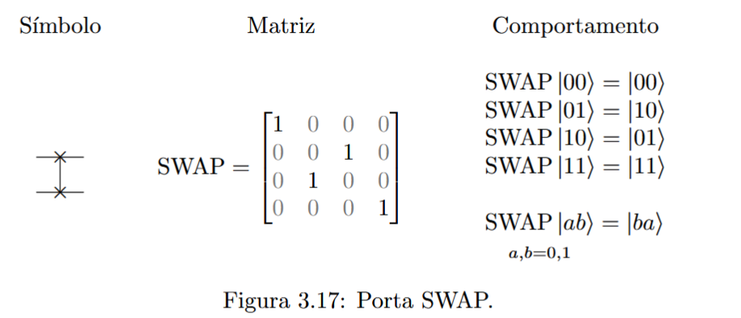

 ### Portas Lógicas de 3 Qubits

  As principais operações em 3 qubits são as portas Toffoli, também conhecida por CCNOT (CNOT controlada), e Fredkin, ou CSWAP (SWAP controlada). 

 **Porta Toffoli ou CCNOT**

  A porta Toffoli é uma operação linear que envolve 3 qubits. Dois deles funcionam como controle e um, como alvo. O alvo só é modificado (pela aplicação da porta $X$) se o estado dos dois controles for $\ket{1}\ket{1}$. 

Novamente, quando não houver outra indicação, os qubits de controle são o primeiro e o segundo, e o alvo é o terceiro qubit. Pode-se especificar os qubits de controle e de alvo por meio de índices, como por exemplo:

 **Porta Fredkin ou CSWAP**
 
  A porta de Fredkin possui um qubit de controle e dois alvos. Se o controle for $\ket{1}$, uma porta SWAP atua nos alvos.

## Identidades de Circuitos

Esta seção reúne algumas propriedades das portas lógicas quânticas vistas anteriormente. Também são apresentadas identidades úteis para se manipular circuitos quânticos.

### Identidades para as matrizes de Pauli

Valem as seguintes relações para as matrizes de Pauli $X$, $Y$ e $Z$.

$$
  \begin{split}
    X^2 &= I \\
    Y^2 &= I \\
    Z^2 &= I
  \end{split}

  \begin{split}
    XY &= iZ \\
    YZ &= iX \\
    ZX &= iY
  \end{split}
$$

**Prova**

$$
\begin{aligned}
    XX &= \begin{bmatrix}0 & 1 \\ 1 & 0\end{bmatrix} \begin{bmatrix}0 & 1 \\ 1 & 0\end{bmatrix} = \begin{bmatrix}1 & 0 \\ 0 & 1\end{bmatrix} = I \\
    YY &= \begin{bmatrix}0 & -i \\ i & 0\end{bmatrix} \begin{bmatrix}0 & -i \\ i & 0\end{bmatrix} = \begin{bmatrix}1 & 0 \\ 0 & 1\end{bmatrix} = I \\
    ZZ &= \begin{bmatrix}1 & 0 \\ 0 & -1\end{bmatrix} \begin{bmatrix}1 & 0 \\ 0 & -1\end{bmatrix} = \begin{bmatrix}1 & 0 \\ 0 & 1\end{bmatrix} = I \\
    XY &= \begin{bmatrix}0 & 1 \\ 1 & 0\end{bmatrix} \begin{bmatrix}0 & -i \\ i & 0\end{bmatrix} = \begin{bmatrix}i & 0 \\ 0 & -i\end{bmatrix} = iZ \\
    YZ &= \begin{bmatrix}0 & -i \\ i & 0\end{bmatrix} \begin{bmatrix}1 & 0 \\ 0 & -1\end{bmatrix} = \begin{bmatrix}0 & i \\ i & 0\end{bmatrix} = iX \\
    ZX &= \begin{bmatrix}1 & 0 \\ 0 & -1\end{bmatrix} \begin{bmatrix}0 & 1 \\ 1 & 0\end{bmatrix} = \begin{bmatrix}0 & 1 \\ -1 & 0\end{bmatrix} = iY
\end{aligned}
$$

### Matrizes de Pauli na base $\ket{+},\ket{-}$

Fazendo-se a mudança de base de $\ket{0},\ket{1}$ para $\ket{+},\ket{-}$ por meio da matriz $H$, obtém-se para as matrizes de Pauli:

$$
\begin{aligned}
   HXH &= Z \\
   HYH &= -Y \\
   HZH &= X
\end{aligned}
$$
  
  Portanto, na nova base $\ket{+},\ket{-}$, a matriz do operador $X$ é $Z$, a matriz de $Y$ é $-Y$ e a matriz de $Z$ é $X$.  

  **Prova**

$$
     \begin{split}
    HXH &= \tfrac{1}{\sqrt{2}}\begin{bmatrix}1 & 1 \\ 1 & -1\end{bmatrix}
          \begin{bmatrix}0 & 1 \\ 1 & 0\end{bmatrix}
          \tfrac{1}{\sqrt{2}}\begin{bmatrix}1 & 1 \\ 1 & -1\end{bmatrix} \\
        &= \tfrac{1}{2}\begin{bmatrix}1 & 1 \\ 1 & -1\end{bmatrix}
          \begin{bmatrix}1 & -1 \\ 1 & 1\end{bmatrix} \\
        &= \tfrac{1}{2}\begin{bmatrix}2 & 0 \\ 0 & -2\end{bmatrix}
          = \begin{bmatrix}1 & 0 \\ 0 & -1\end{bmatrix} = Z, \\
    HYH &= \tfrac{1}{\sqrt{2}}\begin{bmatrix}1 & 1 \\ 1 & -1\end{bmatrix}
          \begin{bmatrix}0 & -i \\ i & 0\end{bmatrix}
          \tfrac{1}{\sqrt{2}}\begin{bmatrix}1 & 1 \\ 1 & -1\end{bmatrix} \\
        &= \tfrac{1}{2}\begin{bmatrix}1 & 1 \\ 1 & -1\end{bmatrix}
          \begin{bmatrix}-i & i \\ i & i\end{bmatrix} \\
        &= \tfrac{1}{2}\begin{bmatrix}0 & 2i \\ -2i & 0\end{bmatrix}
          = -\begin{bmatrix}0 & -i \\ i & 0\end{bmatrix} = -Y, \\
    HZH &= \tfrac{1}{\sqrt{2}}\begin{bmatrix}1 & 1 \\ 1 & -1\end{bmatrix}
          \begin{bmatrix}1 & 0 \\ 0 & -1\end{bmatrix}
          \tfrac{1}{\sqrt{2}}\begin{bmatrix}1 & 1 \\ 1 & -1\end{bmatrix} \\
        &= \tfrac{1}{2}\begin{bmatrix}1 & 1 \\ 1 & -1\end{bmatrix}
          \begin{bmatrix}1 & 1 \\ -1 & 1\end{bmatrix} \\
        &= \tfrac{1}{2}\begin{bmatrix}0 & 2 \\ 2 & 0\end{bmatrix}
          = \begin{bmatrix}0 & 1 \\ 1 & 0\end{bmatrix} = X.
\end{split}
$$

### Inversa de Hadamard

A porta de Hadamard é sua própria inversa.

Pode-se verificar fazendo a conta com matrizes diretamente.

$$
\begin{split}
  HH &= \tfrac{1}{\sqrt{2}}\begin{bmatrix}1 & 1 \\ 1 & -1\end{bmatrix}
      \tfrac{1}{\sqrt{2}}\begin{bmatrix}1 & 1 \\ 1 & -1\end{bmatrix} \\
       &= \tfrac{1}{2}\begin{bmatrix}2 & 0 \\ 0 & 2\end{bmatrix} = I
\end{split}
$$
    
Outra maneira de se verificar isso é perceber que $H$ é hermitiana ($H^\dagger = H$) e unitária ($H^{-1} = H^\dagger$), de forma que $H^{-1} = H^\dagger = H$.

#### Relação entre as portas $S$ e $T$

As portas CNOT e SWAP são suas próprias inversas. CNOT^2 = SWAP^2 = I 

 

#### CNOT por Z

  A porta CNOT pode ser obtida usando-se uma porta $Z$ controlada:

#### SWAP por CNOT

A porta SWAP pode ser construída por 3 portas CNOT:

### Universalidade das Portas Lógicas Quânticas

É útil saber quais conjuntos de portas lógicas quânticas permitem reproduzir qualquer operação unitária $U$ em $n$ qubits. Essa questão é conhecida como \emph{universalidade} de um conjunto de portas lógicas quânticas. A universalidade pode ter um sentido estrito -- isto é, uma operação $U$ qualquer pode ser implementada exatamente com um número finito portas lógicas -- ou um sentido amplo -- isto é, a operação $U$ pode ser aproximada, permitindo-se um erro $\varepsilon$ arbitrado, por uma sequência finita de portas lógicas (cujo número é função do erro $\varepsilon$ máximo estipulado). 

#### Universalidade de Portas Lógicas na Computação Clássica Reversível

 Na Computação Clássica Reversível, as funções booleanas têm o mesmo número de bits na entrada e saída, e as portas lógicas são reversíveis (isto é, conhecendo-se a saída, é possível determinar a entrada que a originou). As portas lógicas NOT, CNOT, SWAP, Toffoli e Fredkin, quando trabalhando apenas com bits e não qubits, são exemplos de portas lógicas clássicas reversíveis. 

**Teorema 1:** A porta Toffoli é universal para a Computação Clássica. 

É possível realizar as portas NOT e AND utilizando a porta Toffoli e acrescentando alguns bits de trabalho (bits com valor fixado em 0 ou 1 dependendo da necessidade). 

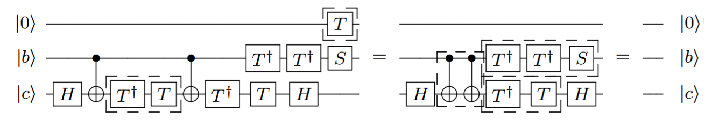

Com isso, um circuito booleano qualquer pode ser realizado apenas com portas Toffoli ignorando-se bits extra (``lixo'').

**Teorema 2:**  A porta Fredkin é universal para a Computação Clássica.

Da mesma forma como para a porta Toffoli, é possível realizar as portas NOT e AND utilizando a porta Fredkin e acrescentando alquns bits de trabalho. 

 Com isso, um circuito booleano qualquer pode ser realizado apenas com portas Fredkin ignorando-se bits extra (``lixo'').

#### Universalidade de Portas Lógicas na Computação Quântica

 Como as portas Toffoli e Fredkin da Computação Clássica têm análogos quânticos, e tendo em vista a universalidade dessas portas na Computação Clássica, tem-se que a Computação Quântica engloba a Computação Clássica quando lança-se mão de qubits de trabalho e ignoram-se os qubits ``lixo''

  É possível verificar que, para a Computação Quântica, todas as portas lógicas de 1 qubit e a porta CNOT formam um conjunto universal no sentido estrito (ou seja, capaz de produzir exatamente, em princípio, qualquer transformação unitária) 
  
  O conjunto finito de operações $X$, $Y$, $Z$, $H$, $T$, $S$, e CNOT também é universal, agora no sentido amplo (isto é, capaz apenas de aproximar uma operação unitária geral dentro de uma faixa de erro pré-determinada). Esse conjunto não é mínimo, pois  algumas dessas portas de 1 qubit podem ser obtidas das demais. Por exemplo: $S = T^2$, $Z=HXH = S^2$, $Y = -iZX$. 
  
  As portas lógicas quânticas Toffoli e Hadamard formam um conjunto universal capaz de aproximar qualquer matriz unitária com coeficientes reais. Com o uso de um qubit extra, de trabalho, é possível realizar operações unitárias gerais em função de matrizes unitárias com coeficientes reais 
  
  O assunto de universalidade de portas lógicas quânticas está em desenvolvimento. Não se conhece um algoritmo ou método eficiente capaz de decompor uma matriz unitária $U$ em fatores de um dado conjunto universal. A maioria dos conjuntos finitos que foram provados universais têm suas demonstrações baseadas em argumentos de existência: mostra-se que existe uma sequência de portas que aproxima dentro de um erro dado a porta $U$, mas não se sabe como encontrar essa aproximação. Para a universalidade de todas as portas de 1 qubit mais a CNOT, a prova é construtiva, mas recorre à disponibilidade de qualquer porta de 1 qubit, além de não ser eficiente em geral (isto é, requerer um número de portas lógicas exponencial no número de qubits $n$).

### Teorema da Não-Clonagem

Um bit clássico pode ser copiado para servir como entrada em diversas partes de um circuito digital clássico.

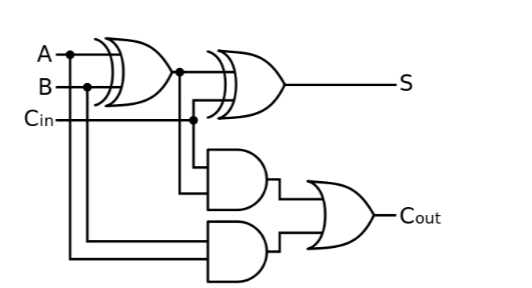

 Pode-se pensar nesse comportamento em termos da porta lógica clássica COPY que devolve à saída duas (ou mais) cópias do bit de entrada. 

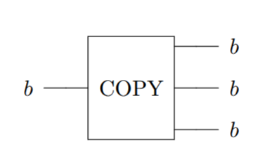

Como na Computação Quântica, o análogo das portas lógicas seriam as operações unitárias sobre qubits, poderia-se cogitar a existência de uma porta lógica quântica de 2 qubits que tivesse como entrada um qubit num estado $\ket{\psi}$ qualquer, a ser copiado, (e outra entrada $\ket{0}$ para completar 2 entradas) e devolvesse 2 qubits no estado $\ket{\psi}$, como ilustrado na figura a seguir.

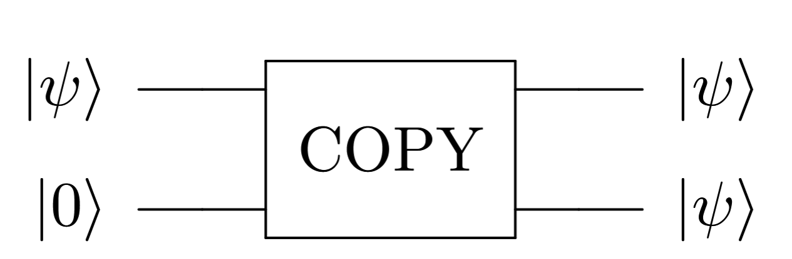

No entanto, o chamado *Teorema da Não Clonagem* informa que não existe uma operação unitária capaz de efetuar essa operação para qualquer estado $\ket{\psi}$ de entrada. Desse modo, a cópia de bits não possui análogo na Computação Quântica.

**Teorema da Não Clonagem:**  Não existe uma operação unitária que permita copiar o estado de 1 qubit em 2 (ou mais) qubits. Isto é, não existe operação unitária $U$ que satisfaça, para todo estado $\ket{\psi}$ de 1 qubit, o seguinte:

 **Prova:** 

  A prova se dá por redução ao absurdo. Seja $U$ uma tal operação unitária, satisfazendo $U\ket{\psi}\ket{0} = \ket{\psi}\ket{\psi}$ para todo estado $\ket{\psi}$ com $||\ket{\psi}|| = 1$. 
  
  Considere os estados de 1 qubit $\ket{1}$ e $\ket{+}$. Tem-se que
  
$$
  \begin{split}
   \braket{10}{+0}_{1,2} 
   &= \braket{1}{+}_1 \braket{0}{0}_2 \\
   &= \braket{1}{+} \cdot 1 \\
   &= \bra{1} \left(\frac{\ket{0} + \ket{1}}{\sqrt{2}} \right) \\
   &= \frac{1}{\sqrt{2}} \ .
  \end{split}
$$

 Por outro lado, como $U$ é unitária, também vale que

$$
\begin{split}
    \braket{10}{+0}_{1,2} 
    &= \bra{10}_{1,2} U^\dagger U \ket{+0}_{1,2} \\
    &= \bra{11}_{1,2} \ket{++}_{1,2} \\
    &= \braket{1}{+} \braket{1}{+} \\ 
    &=  \frac{1}{\sqrt{2}} \cdot  \frac{1}{\sqrt{2}} \ .
   \end{split}
$$

 Comparando (1) e (2), tem-se que: $\frac{1}{\sqrt{2}} =  \frac{1}{\sqrt{2}} \cdot  \frac{1}{\sqrt{2}} $, 

 O que não pode ocorrer. Portanto a hipótese de que existe $U$ como descrito acima é falsa.  

 É possível generalizar essa demonstração para mostrar que não existe operação unitária $U$ tal que $U\ket{\psi}\ket{s} = \ket{\psi}\ket{\psi}$ para todo estado $\ket{\psi}$, e com $\ket{s}$ um estado fixo qualquer
 
 Apesar de não ser possível clonar um estado arbitrário, é possível copiar estados na base computacional. De fato, uma porta CNOT é suficiente para realizar isso.

 **Proposição:** Clonagem de estados $\ket{0},\ket{1}$

  O circuito abaixo realiza a clonagem de estados da base computacional. Se $a = 0,1$, tem-se:
  
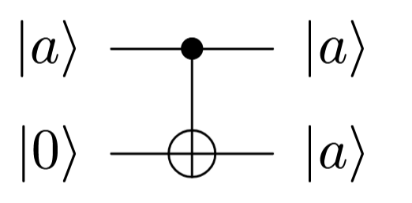

  **Prova:** 

Segue do comportamento da porta CNOT nos vetores da base computacional:

$$
\ket{a}\ket{0} \ \  \xrightarrow{\text{CNOT}} \ \  \ket{a}\ket{0\oplus a} = \ket{a} \ket{a}
$$