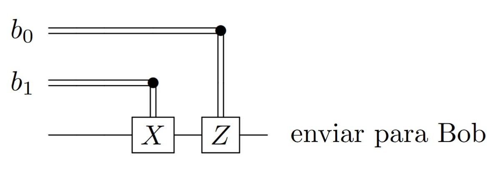
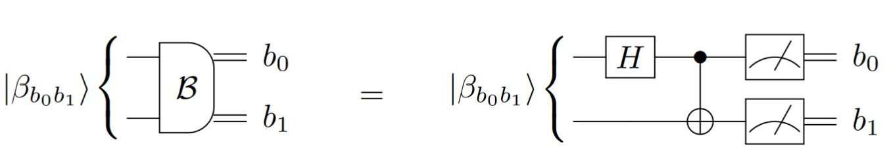
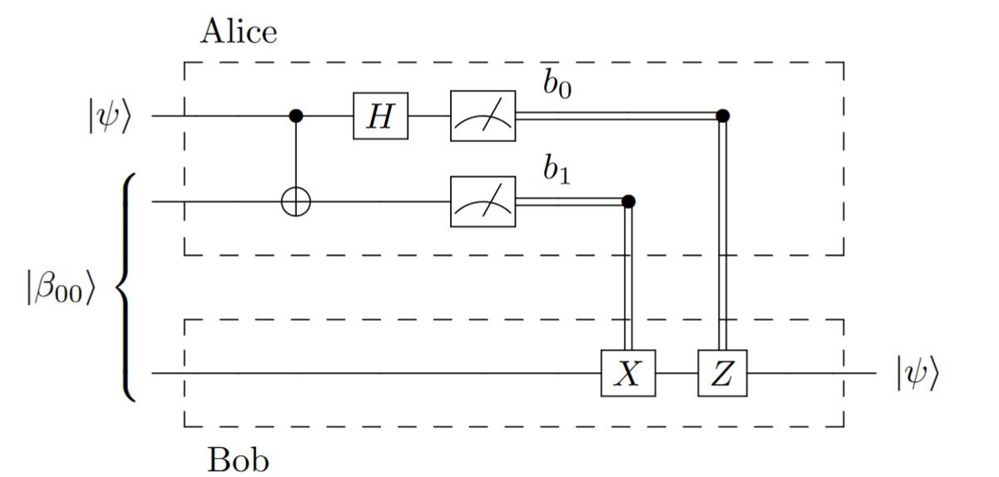
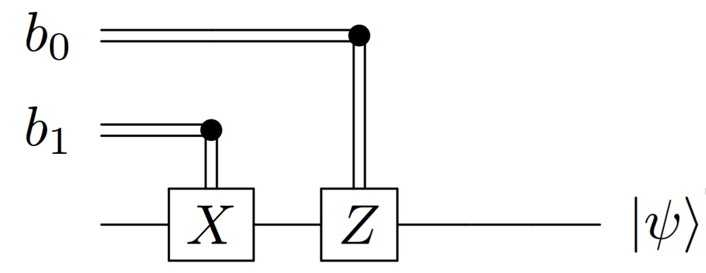
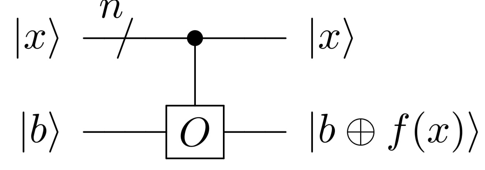
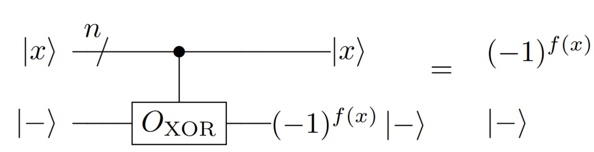

# Algoritmos Quânticos

```{note}
Material extraído do TCC [*Computação Quântica: Uma abordagem para estudantes de graduação em Ciências Exatas*](./tcc-giovani.pdf), de Giovani Goraiebe Pollachini.
```

Neste capítulo serão abordados alguns protocolos e algoritmos quânticos conhecidos na literatura. Quando possível, é feita uma comparação com os algoritmos clássicos conhecidos.

## Codificação superdensa

A codificação superdensa é um protocolo que envolve duas partes, Alice e Bob, que queiram se comunicar trocando bits. Alice quer enviar bits de mensagem para Bob.

```{note}
Em Teoria da Informação e Criptografia Quântica, é uma convenção tácita rotular os dois lados da comunicação por Alice e Bob!
```

Não é possível, classicamente, codificar 2 bits de mensagem em 1 bit transmitido, já que só há 2¹ = 2 palavras código – as palavras 0 e 1 – e 2² = 4 palavras de mensagem que podem ser enviadas – as palavras 00, 01, 10 e 11. No entanto, é possível codificar 2 bits de mensagem em 1 qubit transmitido, e é essa a função do circuito de codificação superdensa.

Uma referância para este conteúdo é {cite}`nielsen_quantum_2010` seção 2.3, p. 97-98

### Visão geral 

A codificação superdensa envolve o compartilhamento prévio de um par de qubits emaranhados, no estado de Bell $\ket{\beta_{00}}= \frac{\ket{00}+\ket{11}}{\sqrt{2}}$. Esse estado independe da mensagem que Alice quer enviar a Bob, e pode ter sido distribuído por uma fonte externa de pares emaranhados.

Assim, o primeiro qubit está com Alice e o segundo, com Bob. Alice pode realizar operações em seu qubit em função dos bits de mensagem que ela quer enviar. Após as operações, ela envia seu qubit a Bob, que passa a estar em posse dos dois qubits. Bob pode medí-los de maneira a obter os bits de mensagem.

### Circuito

O circuito completo para a codificação superdensa é representado abaixo. Seu funcionamento detalhado será abordado a seguir.


### Funcionamento detalhado

**Setup**

Num primeiro momento, Alice e Bob compartilham o estado de Bell
$$
\ket{\beta_{00}} = \frac{\ket{00} + \ket{11}}{\sqrt{2}}
$$

Usamos os rótulos $A$ para o primeiro qubit (da Alice) e $B$ para o segundo qubit (que está com Bob). 

**Codificação - Alice**

Alice conseguirá 4 estados da base de Bell distintos em função dos bits de mensagem.

$$
\begin{array}{ccc}
   \text{Mensagem} & \text{Operação} & \text{Resultado} \\ \hline 
   00 & I_A & \frac{\ket{00} + \ket{11}}{\sqrt{2}} = \ket{\beta_{00}} \\
   01 & Z_A & \frac{\ket{00} - \ket{11}}{\sqrt{2}} = \ket{\beta_{01}} \\
   10 & X_A & \frac{\ket{01} + \ket{10}}{\sqrt{2}} = \ket{\beta_{10}} \\
   11 & iY_A = Z_A X_A & \frac{\ket{01} - \ket{10}}{\sqrt{2}} = \ket{\beta_{11}}
\end{array}
$$

Observa-se que $ZX = iY$ pela identidade de circuitos. Os estados de Bell $\ket{\beta_{00}}$, $\ket{\beta_{01}}$, $\ket{\beta_{10}}$ e $\ket{\beta_{11}}$ formam uma base para o espaço de 2 qubits. Observa-se também que, se a mensagem é $b_0 b_1$, então quando $b_1 = 1$ aplica-se $X_A$ e quando $b_0 = 1$, aplica-se $Z_A$. Dessa forma, para todos os valores da mensagem $b_0 b_1$, pode-se escrever a operação no qubit $A$ por $Z_A^{\,\, b_0} X_A^{\,\, b_1}$. Portanto, a operação que Alice deve fazer em seu qubit pode ser representada pelo seguinte circuito controlado por cbits:



**Decodificação - Bob**

Alice envia, então, seu qubit a Bob, que realiza uma medida na base de Bell. Bob consegue distinguir em qual estado o par de qubits se encontra com essa medida, e, consequentemente, consegue saber quais bits de mensagem foram enviados: se o resultado for $\ket{\beta_{b_0b_1}}$, então a mensagem é $b_0 b_1$. 
 
A medição na base de Bell pode ser realizada em função da medição na base computacional pelo seguinte circuito:



## Circuito de teletransporte

 O circuito de teletransporte também envolve duas partes, chamadas de Alice e Bob, como de costume. Dessa vez, Alice está em posse de um qubit $\ket{\psi}$ cujo estado lhe é desconhecido e precisa enviá-lo a Bob. No entanto, o único meio de comunicação entre os dois é um canal clássico, por onde só é possível enviar cbits. Pode-se pensar em uma linha telefônica, ou uma conexão de internet entre os dois, por exemplo, e que os dois estão a uma grande distância um do outro. Enviando apenas bits clássicos, Alice deve tentar enviar o estado de seu qubit a Bob.
 
 Aparentemente não seria possível realizar essa tarefa, pois o estado de um qubit $\ket{\psi} = a\ket{0} + b \ket{1}$ é definido por dois números complexos $a$ e $b$, que demandariam muitos bits para serem representados de maneira satisfatória (mas aproximada apenas). Além disso, Alice não tem conhecimento sobre o estado do seu qubit, e uma medida não seria suficiente para conseguir encontrar os coeficientes $a$ e $b$. Seriam necessárias muitas medidas de cópias do sistema em bases diferentes para se conseguir obter estimativas das probabilidades de o resultado ser $\ket{0}$ ou $\ket{1}$, e isso não é possível de se fazer quando não se tem cópias do sistema.  
 
 No entanto, se Alice e Bob estiverem compartilhando um par de qubits emaranhados, a situação torna-se mais favorável. O par emaranhado $ \ket{\beta_{00}} $ pode ter sido distribuído previamente, e não depende do qubit $\ket{\psi}$ de Alice. O circuito de teletransporte faz uso desse par emaranhado para realizar essa tarefa de enviar o estado de um qubit (não conhecido) fazendo-se uso apenas de um canal clássico. O nome ``teletransporte'' tornou-se popular para fazer referência ao circuito, mas não é muito adequado. Esse circuito envia apenas a informação sobre o estado, não ocorrendo deslocamento físico do qubit em questão.
 
Uma referência para esse circuito pode ser encontrado em {cite}`nielsen_quantum_2010`

### Visão geral

Como na codificação superdensa, o circuito de teletransporte necessita do compartilhamento prévio de dois qubits emaranhados no estado de Bell $\ket{\beta_{00}}$, que independe do qubit que Alice quer enviar a Bob. 

Além desse par compartilhado, Alice tem um qubit em um estado $\ket{\psi}$ desconhecido. Alice realiza determinadas operações nos seus dois qubits e realiza medidas na base computacional. Ao medir seus dois qubits, ela obtém informação clássica (cbits), e envia-as a Bob.
   
Bob recebe os cbits e, em função do resultado, realiza algumas operações em seu qubit (o segundo qubit do par emaranhado compartilhado previamente).  Essas operações o ajudam a recuperar o estado do qubit que Alice queria enviar, completando a tarefa. 
   
Nesse processo, o qubit $\ket{\psi}$ de Alice tem seu estado destruído pela medida, mas reaparece no qubit de Bob por causa do emaranhamento, restando apenas realizar uma correção em função do resultado da medida de Alice.

### Circuito

O circuito abaixo realiza o teletransporte do estado de 1 qubit de Alice para Bob utilizando apenas o envio de 2 cbits. O funcionamento detalhado do Circuito de Teletransporte será visto adiante. 



### Funcionamento detalhado

**Setup**
Alice e Bob previamente compartilham o estado de Bell

$$
\ket{\beta_{00}} = \frac{\ket{00} + \ket{11}}{\sqrt{2}}
$$

Alice também possui um qubit $\ket{\psi} = a\ket{0} + b\ket{1}$ em um estado não necessariamente conhecido por ela. Sua intenção é que Bob tenha uma ``cópia'' do estado desse qubit. Usando-se os rótulos $A_1$ e $A_2$ para os qubits de Alice e $B$ para o de Bob, o estado do sistema completo pode ser escrito como

$$
\begin{split}
       \ket{\psi_0} 
       &= \ket{\psi}_{A_1} \ket{\beta_{00}}_{A_2 B} \\
       &=  \big( a \ket{0}_{A_1} + b \ket{1}_{A_1} \big) \frac{1}{\sqrt{2}}\big(\ket{0}_{A_2}\ket{0}_B +  \ket{1}_{A_2}\ket{1}_B \big) \\
       &=  \tfrac{a}{\sqrt{2}} \ket{0}_{A_1} \ket{0}_{A_2}\ket{0}_B  + \tfrac{a}{\sqrt{2}} \ket{0}_{A_1} \ket{1}_{A_2}\ket{1}_B  \\
       &\phantom{=} \quad + \tfrac{b}{\sqrt{2}} \ket{1}_{A_1} \ket{0}_{A_2}\ket{0}_B  + \tfrac{b}{\sqrt{2}} \ket{1}_{A_1} \ket{1}_{A_2}\ket{1}_B \\
       &=  \left(  \tfrac{a}{\sqrt{2}} \ket{0}_{A_1} \ket{0}_{A_2} + \tfrac{b}{\sqrt{2}} \ket{1}_{A_1} \ket{0}_{A_2}\right) \ket{0}_B   \\
       &\phantom{=} \quad  + \left( \tfrac{a}{\sqrt{2}} \ket{0}_{A_1} \ket{1}_{A_2} + \tfrac{b}{\sqrt{2}} \ket{1}_{A_1} \ket{1}_{A_2} \right)\ket{1}_B    \ . 
      \end{split}
$$

**Preparação - Alice**

Alice realiza as operações CNOT nos dois qubits e Hadamard em $A_1$, e o sistema completo passa a ficar no estado:

$$
\begin{split}
    \ket{\psi_1} 
    &= \text{CNOT}_{A_1,A_2} \ket{\psi_0} \\
    &= \text{CNOT}_{A_1,A_2} \bigg[ \left(  \tfrac{a}{\sqrt{2}} \ket{0}_{A_1} \ket{0}_{A_2} + \tfrac{b}{\sqrt{2}} \ket{1}_{A_1} \ket{0}_{A_2}\right) \ket{0}_B   \\
     &\phantom{=} \quad  + \left( \tfrac{a}{\sqrt{2}} \ket{0}_{A_1} \ket{1}_{A_2} + \tfrac{b}{\sqrt{2}} \ket{1}_{A_1} \ket{1}_{A_2} \right)\ket{1}_B \bigg]\\
   &=\left( \tfrac{a}{\sqrt{2}} \text{CNOT}_{A_1,A_2} \ket{0}_{A_1} \ket{0}_{A_2} + \tfrac{b}{\sqrt{2}}  \text{CNOT}_{A_1,A_2} \ket{1}_{A_1} \ket{0}_{A_2}\right) \ket{0}_B   \\
       &\phantom{=} \quad  + \left( \tfrac{a}{\sqrt{2}} \text{CNOT}_{A_1,A_2}\ket{0}_{A_1} \ket{1}_{A_2} + \tfrac{b}{\sqrt{2}} \text{CNOT}_{A_1,A_2} \ket{1}_{A_1} \ket{1}_{A_2} \right)\ket{1}_B \\
   &= \left( \tfrac{a}{\sqrt{2}} \ket{0}_{A_1} \ket{0}_{A_2} + \tfrac{b}{\sqrt{2}}  \ket{1}_{A_1} \ket{1}_{A_2}\right) \ket{0}_B   \\
       &\phantom{=} \quad  + \left( \tfrac{a}{\sqrt{2}} \ket{0}_{A_1} \ket{1}_{A_2} + \tfrac{b}{\sqrt{2}} \ket{1}_{A_1} \ket{0}_{A_2} \right)\ket{1}_B \\
   \end{split}
$$

$$
\begin{split}
    \ket{\psi_2} 
    &= H_{A_1} \ket{\psi_1} \\
    &= H_{A_1} \left( \tfrac{a}{\sqrt{2}} \ket{0}_{A_1} \ket{0}_{A_2} + \tfrac{b}{\sqrt{2}}  \ket{1}_{A_1} \ket{1}_{A_2}\right) \ket{0}_B   \\
       &\phantom{=} \quad  + H_{A_1} \left( \tfrac{a}{\sqrt{2}} \ket{0}_{A_1} \ket{1}_{A_2} + \tfrac{b}{\sqrt{2}} \ket{1}_{A_1} \ket{0}_{A_2} \right)\ket{1}_B \\
    &=  \left( \tfrac{a}{\sqrt{2}} H_{A_1}\ket{0}_{A_1} \ket{0}_{A_2} + \tfrac{b}{\sqrt{2}}  H_{A_1}\ket{1}_{A_1} \ket{1}_{A_2}\right) \ket{0}_B   \\
       &\phantom{=} \quad  + \left( \tfrac{a}{\sqrt{2}} H_{A_1}\ket{0}_{A_1} \ket{1}_{A_2} + \tfrac{b}{\sqrt{2}} H_{A_1} \ket{1}_{A_1} \ket{0}_{A_2} \right)\ket{1}_B \\
    &=  \left( \tfrac{a}{2} \big(\ket{0}_{A_1} + \ket{1}_{A_1}\big) \ket{0}_{A_2} + \tfrac{b}{2} \big(\ket{0}_{A_1} - \ket{1}_{A_1}\big) \ket{1}_{A_2}\right) \ket{0}_B   \\
       &\phantom{=} \quad  + \left( \tfrac{a}{2} \big(\ket{0}_{A_1} + \ket{1}_{A_1}\big)\ket{1}_{A_2} + \tfrac{b}{2} \big(\ket{0}_{A_1} - \ket{1}_{A_1}\big) \ket{0}_{A_2} \right)\ket{1}_B \\   
    &= \ket{00}_{A_1A_2}\left( \tfrac{a}{2} \ket{0}_B + \tfrac{b}{2} \ket{1}_B \right) + \ket{01}_{A_1A_2}\left( \tfrac{b}{2} \ket{0}_B + \tfrac{a}{2} \ket{1}_B \right) \\
       &\phantom{=} \quad  + \ket{10}_{A_1A_2}\left( \tfrac{a}{2} \ket{0}_B - \tfrac{b}{2} \ket{1}_B \right)  + \ket{11}_{A_1A_2}\left(- \tfrac{b}{2} \ket{0}_B + \tfrac{a}{2} \ket{1}_B   \right) 
    \end{split}
$$

Alice realiza, então, a medida dos seus dois qubits na base computacional. Essa medida faz com que o sistema total encontre-se no estado:

$$
\ket{\psi_3} = \ket{b_0 b_1}_{A_1A_2} \ket{\psi_3}_B
$$

em que o resultado da medida é $b_0 b_1$. O qubit que está com Bob passa a ficar no estado $\ket{\psi_3}_B$, que depende do valor da medida. As opções possíveis são listadas na tabela a seguir.

$$
\begin{array}{cc}
\text{Resultado da medida} & \text{Estado do qubit } B \\ \hline
00 & \phantom{-} a \ket{0} + b \ket{1} \\
01 & \phantom{-} b \ket{0} + a \ket{1} \\
10 & \phantom{-} a \ket{0} - b \ket{1} \\
11 & - b \ket{0} + a \ket{1}
\end{array}
$$

Caso o resultado da medida tenha sido $00$, o estado do sistema total $\ket{\psi_3}$ é obtido pela projeção $\ket{00}\bra{00}_{A_1A_2}$ seguida de uma normalização do vetor resultante. É conveniente lembrar que $|a|^2 + |b|^2 = 1$ pela normalização do estado $\ket{\psi} = a\ket{0} + b\ket{1}$ do início do algoritmo.

$$
\begin{split}
      \ket{\psi_2} 
      &= \frac{\ket{00}_{A_1A_2}\left( \tfrac{a}{2} \ket{0}_B + \tfrac{b}{2} \ket{1}_B \right)}{ \sqrt{|\tfrac{a}{2}|^2 + |\tfrac{b}{2}|^2 } }  \\
      &= \frac{\ket{00}_{A_1A_2}\left( \tfrac{a}{2} \ket{0}_B + \tfrac{b}{2} \ket{1}_B \right)}{ \tfrac{1}{2} \sqrt{|a|^2 + |b|^2 } }  \\
      &= \ket{00}_{A_1A_2}\left( a \ket{0}_B + b \ket{1}_B \right) \ .
    \end{split}
$$

Os outros estados da tabela sãoo obtidos com contas similares

**Processamento final - Bob**

Para recuperar o estado $a\ket{0} + b\ket{1}$, Bob deve fazer algumas operações para corrigir o estado do seu qubit, em função do valor da medida informado a ele. 
  
Se a medida for $00$, seu qubit está em $ a\ket{0} + b\ket{1}$ e nada precisa ser feito. Se a medida resultou em $01$, seu qubit está em $b\ket{0} + a\ket{1}$; nesse caso, é possível perceber que a porta $X$ fornece novamente o estado desejado $b\ket{1} + a\ket{0}$. Considerando-se todos os resultados possíveis da medida, monta-se a correção necessária para cada caso.



Essas operações, como na codificação superdensa, podem ser resumidas na operação controlada classicamente $Z_B^{\, b_0} X_B^{\, b_1}$, em que $b_0b_1$ é o resultado da medida. Dessa forma, pode-se representar o processamento de Bob pelo circuito a seguir.

$$
\begin{array}{cccc}
\text{Medida} & \text{Estado do qubit } B & \text{Aplicar operações} & \text{Estado final} \\ \hline 
00 & \phantom{-} a \ket{0} + b \ket{1} & I_B & a \ket{0} + b \ket{1} = \ket{\psi} \\
01 & \phantom{-} b \ket{0} + a \ket{1} & X_B & a \ket{0} + b \ket{1} = \ket{\psi} \\
10 & \phantom{-} a \ket{0} - b \ket{1} & Z_B & a \ket{0} + b \ket{1} = \ket{\psi} \\
11 & - b \ket{0} + a \ket{1} & Z_B X_B & a\ket{0} + b \ket{1} = \ket{\psi}
\end{array}
$$

Com isso, independente do resultado da medida, Bob tem, ao final, o estado $\ket{\psi}$ que Alice queria transmitir. 

## Oráculos quânticos

 Os oráculos são funções booleanas $f \colon \{ 0,1 \}^n \to \{ 0,1 \}$ consideradas como ``caixas pretas''. Dado um vetor de bits $x$, o oráculo clássico fornece $f(x)$. Alguns problemas computacionais são escritos em termos de oráculos, como o problema de Deutsch-Jozsa, o problema de Simon e o problema de busca de Grover. Para abordar esses problemas, é necessário definir uma versão quântica desse oráculo, o que será abordado nesta seção. 
 
 Há duas maneiras de se escrever um análogo quântico ao oráculo clássico: o oráculo XOR e o oráculo de fase.

 ### Oráculo XOR

O oráculo XOR é uma operação unitária que realiza a função booleana $f$ por meio de um bit extra, que sinaliza as entradas em que $f$ vale 1. 



### Construção do Oráculo de Fase usando o Oráculo XOR

Pode-se obter o oráculo de fase a partir do oráculo XOR com o uso do qubit alvo como um qubit auxiliar. Ao usarmos $\ket{-}$ na entrada alvo do oráculo XOR, obtemos, para qualquer estado $\ket{x}$ da base computacional:

$$
\ket{x}\ket{-} = \ket{x}\tfrac{\ket{0}-\ket{1}}{\sqrt{2}} \xrightarrow{O_{\text{XOR}}} 
  \begin{cases}
   \ket{x}\frac{\ket{0}-\ket{1}}{\sqrt{2}} = \ket{x}\ket{-}    &\text{se $f(x)=0$}  \\
   \ket{x}\frac{\ket{1}-\ket{0}}{\sqrt{2}} = \ket{x}(-\ket{-}) &\text{se $f(x)=1$} \ ,
  \end{cases}
$$

  o que pode ser resumido por $\ket{x}\big((-1)^{f(x)}\ket{-} \big)$. Além disso, o fator multiplicativo $(-1)^{f(x)}$ pode ser movido para qualquer entrada tensorial por multilinearidade do produto tensorial:

$$
\ket{x}\otimes(-1)^{f(x)}\ket{-} =  (-1)^{f(x)} \ket{x}\otimes\ket{-}
$$

A figura a seguir ilustra a construção do oráculo de fase.

